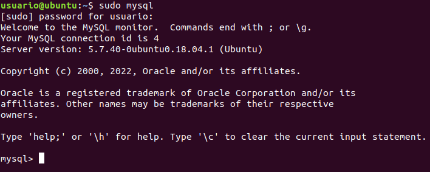
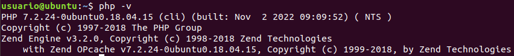

# Ejercicio 2
Para instalar mysql es muy sencillo solo tendremos que usar este comando:
```bash
sudo apt install mysql-server
```
Para comprobar que funciona pondremos este comando en la consola de comando:


Para instalar el php introduciremos este comando:
```bash
sudo apt install php libapache2-mod-php php-mysql
```
Para comprobar que funciona pondremos este comando en la consola de comando:

