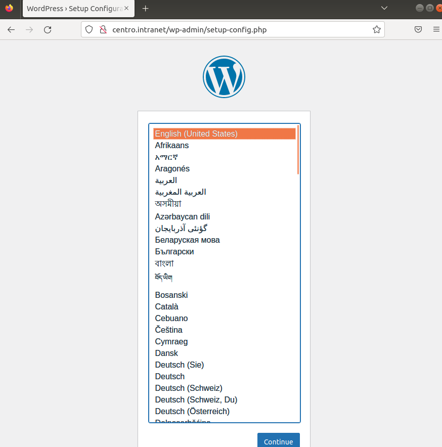
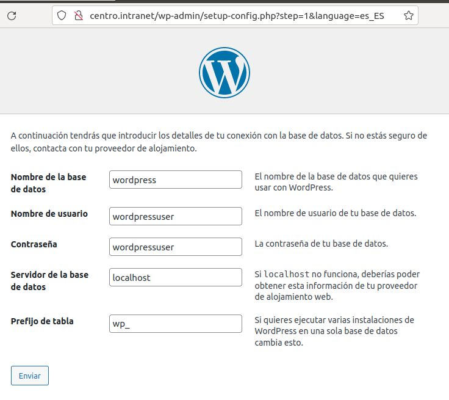
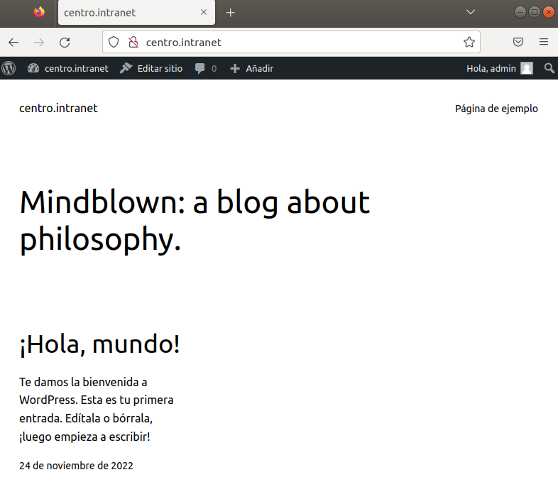

Para realizar este ejercicio deberemos descargar el archivo de wordpress en www.wordpress.com

Una vez descargado el zip usaremos el comando:
```bash
unzip wordpress-4.9.5.zip
```
Ahora moveremos todo lo que esta dentro de la carpeta extraida a la carpeta de centros.intranet:
```bash
mv wordpress-4.9.5 wordpress/* /var/www/centro.intranet
```
Luego de mover todo lo que esta dentro de la carpeta abriremos el mysql:
```bash
sudo mysql
```
Dentro de mysql haremos estos comandos:
```bash
create database wordpress;
```
Ahora una vez creada la base de datos introduciremos 
```bash 
grant all on wordpress.* to 'wordpressuser'@'localhost' identified by 'wordpressuser';
```
 Ahora iremos a la página de centros.intranet y nos saldra esto:
 
 Eligiremos el idioma y nos llevara a una pagina para configurarlo,pondremos esto:
 
 Le daremos a enviar,pondremos un usuario y contraseña y al volver a introducir centros.intranet nos meteremos en esta página:
  
