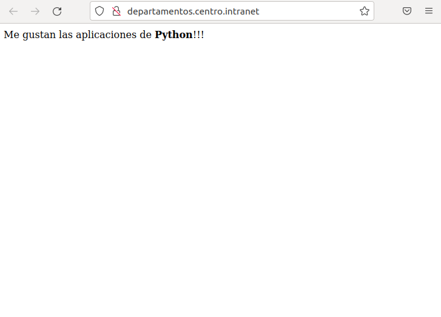

Dentro de la carpeta /var/www/html/departamentos.centro.intranet crearemos las dos carpetas, 
mypythonapp y public_html:
```bash
sudo mkdir public_html
sudo mkdir mypythonapp
```
Crearemos un archivo python controlador dentro de la carpeta mypythonapp
```bash
sudo nano controller.py
```

Escribiremos lo siguiente

```python
# -*- conding: utf-8 -*-

def application(environ, start_response):
    # Genero la salida HTML a mostrar al usuario
    output = "<p>Me gustan las aplicaciones de<b>Python</b>!!!</p>"
    # Inicio una respuesta al navegador
    start_response('200 OK', [('Content-Type', 'text/html; charset=utf-8')])
    # Retorno el contenido HTML
    return output
```
Seguidamente, editaremos el archivo de virtual host en el directorio etc/apache2/sites-available

```bash
sudo nano departamentos.centro.intranet.conf
```

Dentro escribiremos lo siguiente

```bash
<VirtualHost *:80>
    ServerName departamentos.centro.intranet
    DocumentRoot /var/www/html/departamentos.centro.intranet/public_html
    WSGIScriptAlias / /var/www/html/departamentos.centro.intranet/mypythonapp/controller.py
</VirtualHost>
```
Guardamos el archivo y volveremos  habilitar el virtual host con el siguiente comando
```bash
sudo a2ensite departamentos.centro.intranet.conf
```
Reiniciamos el servicio de apache
```bash
sudo service apache2 restart
```
Y ahora si todo ha salido bien al buscar en departamentos.centro.intranet nos deberia aparecer esto:

