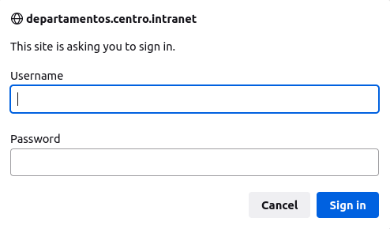

Iniciaremos instalando las utilidades de apache
```bash
sudo apt-get install apache2-utils
```
Vamos a crear el usuario con este comando,luego nos pedira la contraseña:
```bash
sudo htpasswd -c /etc/apache2/.htpasswd usuario
``` 
Ahora, nos iremos al archivo departamentos.centro.intranet.conf en la carpeta /etc/apache2/sites-available/

```bash
sudo nano /etc/apache2/sites-enabled/departamentos.centro.intranet.conf
```

- Y escribiremos lo siguiente dentro del virtual host:

```bash
<Directory "/var/www/html/departamentos.centro.intranet">
      AuthType Basic
      AuthName "Restricted Content"
      AuthUserFile /etc/apache2/.htpasswd
      Require valid-user
  </Directory>
```
Para terminar reiciaremos apache y podremos que cuando queramos entrar a departamentos.centro.intranet nos pedira usuario y contraseña:
```bash
sudo systemctl restart apache2
```

