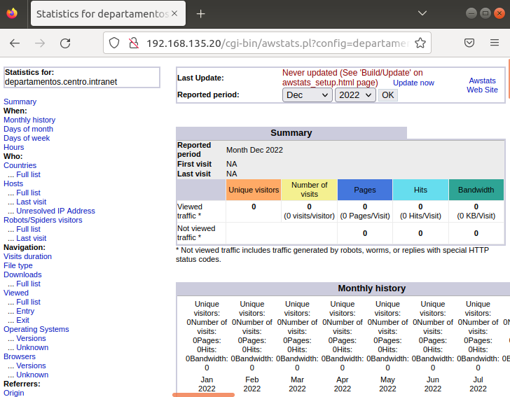

Primero instalaremos el servicio de AWstats
```bash
sudo apt-get install awstats
```
Ahora habilitamos el modulo cgi
```bash
sudo a2enmod cgi
```
Ahora configuraremos el sitio web,primero copiaremos las awstats.conf con el nombre de nuestro dominio y editaremos el archivo recien echo:
```bash
sudo cp /etc/awstats/awstats.conf /etc/awstats/awstats.departamentos.centro.intranet.conf
sudo nano /etc/awstats/awstats.departamentos.centro.intranet.conf
```
Dentro de este archivo buscaremos estas cuatro lineas que estan repartidas dentro del archivo:
```
LogFile=”/var/log/apache2/access.log”
SiteDomain=”departamentos.centro.intranet” 
HostAliases=”departamentos.centro.intranet localhost 127.0.0.1” 
AllowToUpdateStatsFromBrowser=1
```
Empezaremos introduciendo las estadisticas iniciales que se generan a partir de los registros del servidor dentro de nuestro awstat de este server:
```bash
sudo /usr/lib/cgi-bin/awstats.pl -config=departamentos.centro.intranet -update
```

- Por ultimo, configuraremos apache para el AWStats

```
sudo cp -r /usr/lib/cgi-bin /var/www/html/departamentos.centro.intranet
```

Para ver si ha funcionado reiniciaremos apache
```bash
sudo service apache2 restart
```
Para comprobar que se ha implementado el AWstat buscaremos en el buscador en el apartado de la IP pon la tuya,a menos que sea igual no te funcionara en tu maquina virtual/ordenador:
```bash
http://192.168.135.20/cgi-bin/awstats.pl?config=departamentos.centro.intranet
```

